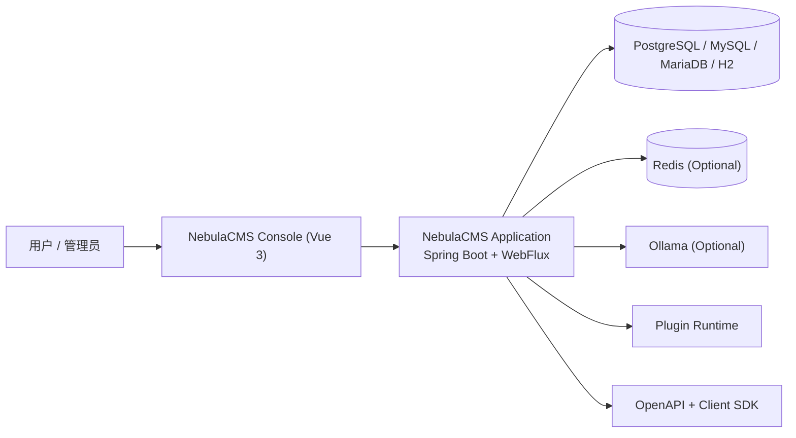

# NebulaCMS - 插件化内容管理平台 | Plugin-first Content Platform

NebulaCMS 不是上游项目的镜像仓库，也不是简单换名 fork；它是面向独立维护、独立发布和私有化部署的二次工程化发行版。

- 独立工程坐标：Java 命名空间、Gradle 坐标、前端包作用域、镜像名和 CI 工件统一为 NebulaCMS。
- 工程化运行时：基于 Java 21、Spring Boot、WebFlux、R2DBC、Vue 3 与 Gradle 多模块结构。
- 可治理配置：数据库、Redis、Ollama、插件预置与镜像发布均可通过环境变量验证和接管。

<p align="center">
  面向个人与团队内容场景的可扩展 CMS（管理后台 + 插件生态 + 私有化部署）
</p>

<p align="center">
  
  
  
  
  
  
</p>

## 40 项工程化改造浓缩摘要

| 改造域 | NebulaCMS 口径 | 可验证点 |
| --- | --- | --- |
| 命名空间 | `run.halo.*` 已迁移到 `io.nebulacms.*`，Gradle 坐标与主应用产物使用 NebulaCMS 命名 | `settings.gradle`、`api/build.gradle`、`application/build.gradle` |
| 插件系统 | 保留插件运行时和扩展点能力，前端插件包切到 `@nebula-labs/*`，预置插件下载可覆盖 | `ui/package.json`、`NEBULACMS_APPSTORE_PLUGIN_URL` |
| WebFlux/R2DBC | 主应用保持响应式 WebFlux + R2DBC 架构，数据库 profile 由环境变量注入 | `application/src/main/resources/application-*.yaml` |
| 配置治理 | 运行目录、数据库、Redis、Ollama、开发代理统一走 `NEBULACMS_*` 前缀 | `.env.example`、`application.yaml` |
| CI/CD | 工作流、工件名、仓库元信息改为 NebulaCMS 语义，保留 Baseline CI 与 CodeQL | `.github/workflows/`、`.github/settings.yml` |
| Docker | GHCR 与 Docker Hub 镜像名切到 NebulaCMS 发行通道 | `ghcr.io/however-yir/nebulacms`、`however-yir/nebulacms` |

> Status: `engineering-distribution`
>
> Upstream traceability: `halo-dev/halo`（仅用于合规来源说明）

> **非官方声明（Non-Affiliation）**  
> 本仓库为社区维护的衍生/二次开发版本，与上游项目及其权利主体不存在官方关联、授权背书或从属关系。  
> **商标声明（Trademark Notice）**  
> 相关项目名称、Logo 与商标归其各自权利人所有。本仓库仅用于说明兼容/来源，不主张任何商标权利。
>
> Series: [talentflow-hr](https://github.com/however-yir/management-systems/tree/main/spring-boot/talentflow-hr) · [aurora-mall](https://github.com/however-yir/management-systems/tree/main/spring-boot/aurora-mall)

## Java 全栈作品线分工

| Repo | 主要角色 | 技术侧重 | 最适合的展示点 |
| --- | --- | --- | --- |
| `NebulaCMS` | 内容平台 | 插件系统、WebFlux、Vue 3 | 插件生态、内容管理、平台化 |
| `TalentFlow HR` | 业务后台 | Spring Boot + Vue | 组织流程、人事场景、后台系统 |
| `Aurora Mall` | 电商系统 | Spring Boot + MyBatis | 商品交易、配置治理、质量门禁 |

---

## 目录

- [1. 项目定位](#1-项目定位)
- [2. 改造目标与工程原则](#2-改造目标与工程原则)
- [3. 改造摘要（40项浓缩版）](#3-改造摘要40项浓缩版)
- [4. 技术架构](#4-技术架构)
- [5. 模块结构](#5-模块结构)
- [6. 快速开始与验证](#6-快速开始与验证)
- [7. 配置说明](#7-配置说明)
- [8. 部署方式](#8-部署方式)
- [9. 与上游差异](#9-与上游差异)
- [10. 仓库元信息](#10-仓库元信息)
- [11. 协议与合规](#11-协议与合规)
- [12. 致谢](#12-致谢)

---

## 1. 项目定位

NebulaCMS 承接上游 CMS 2.x 的开源基础能力，并围绕独立工程、独立品牌和独立交付做系统化改造。它的目标不是保持一个同步镜像，而是形成“可长期维护、可持续迭代、可独立发布”的自有内容平台。

本仓库重点解决三件事：

- 命名与品牌独立：避免与上游包名、镜像名、npm scope 混用
- 配置可注入：数据库、Redis、Ollama 等依赖全部支持环境变量驱动
- 发布链路独立：CI、镜像、前端包作用域、仓库元信息统一为 NebulaCMS

---

## 2. 改造目标与工程原则

### 2.1 改造目标

- 从“Fork 副本”升级为“独立可演进仓库”
- 建立统一的项目命名、品牌与发行链路
- 在不破坏主干结构的前提下完成系统性重构

### 2.2 工程原则

- 可审查：改动尽量落在明确文件与模块边界内
- 可验证：核心配置与构建链路可通过命令直接验证
- 可维护：参数化敏感配置，减少本地化硬编码

---

## 3. 改造摘要（40项浓缩版）

| 类别 | 已完成改造 | 验收口径 |
| --- | --- | --- |
| 命名空间 | 项目名、Java 包名、Gradle group、发布插件 ID、主应用产物名统一为 NebulaCMS | 不再以普通 fork 的包名和产物名对外发行 |
| 插件系统 | 插件运行时、扩展点、前端插件包和预置插件下载链路纳入 NebulaCMS 发行配置 | 插件生态可延续，也可通过环境变量替换预置来源 |
| WebFlux/R2DBC | 主应用保留响应式 WebFlux 与 R2DBC 数据访问，数据库 profile 统一使用注入变量 | 本地、容器和 CI 走同一套启动参数 |
| 配置治理 | 工作目录、数据库、Redis、Ollama、UI 代理、插件预置下载均使用 `NEBULACMS_*` 变量 | `.env.example` 可作为部署模板直接审查 |
| CI/CD | Baseline CI、NebulaCMS Workflow、CodeQL、工件名和仓库设置切到独立语义 | GitHub Actions 页面不再呈现上游品牌混用 |
| Docker | GHCR 与 Docker Hub 默认镜像名切到 NebulaCMS 发行通道 | 镜像拉取、推送和运行命令均指向 NebulaCMS |

---

## 4. 技术架构



---

## 5. 模块结构

```text
nebulacms/
├── api/                    # 公共 API 与扩展模型
├── application/            # 主应用（WebFlux + Security + Plugin）
├── platform/               # 平台依赖与 BOM
├── ui/                     # Vue 3 管理后台与前端子包
├── api-docs/               # OpenAPI 产物
├── e2e/                    # 端到端测试
├── buildSrc/               # 自定义 Gradle 插件
└── .github/                # CI/CD 与仓库设置
```

---

## 6. 快速开始与验证

### 6.1 本地开发

```bash
git clone https://github.com/however-yir/nebulacms.git
cd nebulacms
cp .env.example .env
./gradlew clean build
./gradlew :application:bootRun --args='--spring.profiles.active=dev'
```

### 6.2 本地访问

- 管理后台：`http://127.0.0.1:8090/console`
- API 文档：`http://127.0.0.1:8090/swagger-ui/index.html`

### 6.3 可验证命令

```bash
./gradlew clean check
./gradlew clean build
NEBULACMS_WORK_DIR="$PWD/.nebulacms-dev" ./gradlew :application:bootRun --args='--spring.profiles.active=dev'
```

---

## 7. 配置说明

关键环境变量如下：

| 类别 | 变量 |
| --- | --- |
| 运行目录 | `NEBULACMS_WORK_DIR` |
| 数据库 | `NEBULACMS_DB_URL`, `NEBULACMS_DB_USERNAME`, `NEBULACMS_DB_PASSWORD` |
| Redis | `NEBULACMS_REDIS_HOST`, `NEBULACMS_REDIS_PORT`, `NEBULACMS_REDIS_USERNAME`, `NEBULACMS_REDIS_PASSWORD`, `NEBULACMS_REDIS_DATABASE`, `NEBULACMS_REDIS_SSL` |
| Ollama | `NEBULACMS_OLLAMA_ENABLED`, `NEBULACMS_OLLAMA_BASE_URL`, `NEBULACMS_OLLAMA_MODEL`, `NEBULACMS_OLLAMA_TIMEOUT` |
| 本地开发 | `NEBULACMS_UI_PROXY_ENDPOINT` |
| 插件预置 | `NEBULACMS_APPSTORE_PLUGIN_URL` |
| 镜像发布 | `GHCR_USERNAME`, `GHCR_TOKEN`, `DOCKER_USERNAME`, `DOCKER_TOKEN` |

详细示例见 [`./.env.example`](./.env.example)。

---

## 8. 部署方式

### 8.1 Docker 运行

```bash
docker run -d \
  --name nebulacms \
  -p 8090:8090 \
  -v ~/.nebulacms:/root/.nebulacms \
  --env-file .env \
  ghcr.io/however-yir/nebulacms:latest
```

### 8.2 生产建议

- 数据库与 Redis 使用托管服务并开启备份
- 将 `.env` 交给密钥管理系统（如 Vault / GitHub Secrets）
- CI 使用独立镜像仓库凭据，不复用上游仓库发布凭据

### 8.3 文档与发布入口

| 入口 | 路径 | 作用 |
|---|---|---|
| 文档中心 | `docs/` | 功能、插件、认证、备份等说明 |
| OpenAPI 产物 | `api-docs/openapi/` | API-first 集成与客户端生成 |
| 端到端测试 | `e2e/README.md` | 系统级回归入口 |
| 前端包与控制台 | `ui/` | 管理后台与插件 UI 生态 |
| 工作流 | `.github/workflows/` | 构建、发布与 CI 链路 |

---

## 9. 与上游差异

- 已完成品牌、命名空间、镜像、包作用域、仓库元信息独立化
- 保留上游可追踪基础，便于后续按需同步安全修复
- 配置项全面环境化，适配本地开发、容器化和私有化部署

### 9.1 上游迁移提示

| 迁移面 | 关注点 |
|---|---|
| 命名空间 | `run.halo.*` 已迁移为 `io.nebulacms.*` |
| 前端包作用域 | 从 `@halo-dev/*` 切到 `@nebula-labs/*` |
| 环境变量 | 统一改为 `NEBULACMS_*` 前缀 |
| 工作目录 | 默认从 `.halo2` 切到 `.nebulacms` |
| 发布镜像 | 镜像名、工件名和 CI 流程已改为 NebulaCMS 语义 |

---

## 10. 仓库元信息

仓库元信息模板在 [`./.github/settings.yml`](./.github/settings.yml)，已包含：

- 仓库名称：`nebulacms`
- 仓库描述：`NebulaCMS - independent plugin-first CMS distribution with engineered namespace, branding, and delivery pipeline.`
- Topics：`nebulacms`, `cms`, `spring-boot`, `webflux`, `vue`, `r2dbc`, `plugin-system`, `self-hosted`

---

## 11. 协议与合规

- 主协议：GPL-3.0（见 [`./LICENSE`](./LICENSE)）
- Fork 说明：[`./NEBULACMS_FORK_LICENSE_NOTICE.md`](./NEBULACMS_FORK_LICENSE_NOTICE.md)

---

## 12. 致谢

感谢上游社区提供稳定的基础能力。NebulaCMS 在此基础上进行工程化延展，并保持对上游开源协议的尊重与遵循。
