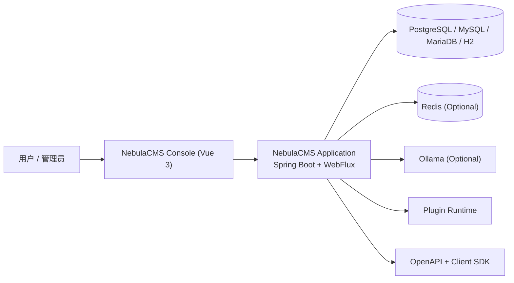

# NebulaCMS

🔥 A plugin-first content platform rebuilt from Halo with independent namespace, branding, and delivery pipeline.  
🚀 Built with Java 21, Spring Boot, WebFlux, R2DBC, Vue 3, and Gradle multi-module architecture.  
⭐ Supports private deployment, plugin extensibility, API-first integration, and env-driven DB/Redis/Ollama configuration.

<p align="center">
  面向个人与团队内容场景的可扩展 CMS（管理后台 + 插件生态 + 私有化部署）
</p>

<p align="center">
  
  
  
  
  
  
</p>

---

## 目录

- [1. 项目定位](#1-项目定位)
- [2. 改造目标与工程原则](#2-改造目标与工程原则)
- [3. 已完成改造（40项）](#3-已完成改造40项)
- [4. 技术架构](#4-技术架构)
- [5. 模块结构](#5-模块结构)
- [6. 快速开始](#6-快速开始)
- [7. 配置说明](#7-配置说明)
- [8. 部署方式](#8-部署方式)
- [9. 与上游差异](#9-与上游差异)
- [10. 仓库元信息](#10-仓库元信息)
- [11. 协议与合规](#11-协议与合规)
- [12. 致谢](#12-致谢)

---

## 1. 项目定位

NebulaCMS 是基于 Halo 2.x 做工程化二次开发后的独立内容平台仓库，目标是形成“可长期维护、可持续迭代、可独立发布”的自有项目形态。

本仓库重点解决三件事：

- 命名与品牌独立：避免与上游包名、镜像名、npm scope 混用
- 配置可注入：数据库、Redis、Ollama 等依赖全部支持环境变量驱动
- 发布链路独立：CI、镜像、前端包作用域、仓库元信息统一为 NebulaCMS

---

## 2. 改造目标与工程原则

### 2.1 改造目标

- 从“Fork 副本”升级为“独立可演进仓库”
- 建立统一的项目命名、品牌与发行链路
- 在不破坏主干结构的前提下完成系统性重构

### 2.2 工程原则

- 可审查：改动尽量落在明确文件与模块边界内
- 可验证：核心配置与构建链路可通过命令直接验证
- 可维护：参数化敏感配置，减少本地化硬编码

---

## 3. 已完成改造（40项）

### 3.1 命名空间与工程坐标

1. `settings.gradle` 项目名改为 `nebulacms`
2. Java 主命名空间从 `run.halo.app` 切换至 `io.nebulacms.app`
3. Java 工具平台命名空间从 `run.halo.tools.platform` 切换至 `io.nebulacms.tools.platform`
4. `api/build.gradle` 的 `group` 改为 `io.nebulacms.app`
5. `application/build.gradle` 的 `group` 改为 `io.nebulacms.app`
6. `platform/application/build.gradle` 坐标改为 Nebula 命名
7. `platform/plugin/build.gradle` 坐标改为 Nebula 命名
8. 自定义 Gradle 插件 ID 从 `halo.publish` 改为 `nebulacms.publish`
9. `buildSrc` 发布插件文件改名为 `nebulacms.publish.gradle`
10. 主应用产物命名从 Halo 命名切换至 NebulaCMS

### 3.2 前端生态与包管理

11. 前端 workspace 包作用域从 `@halo-dev/*` 切换到 `@nebula-labs/*`
12. `ui/package.json` 依赖引用统一切换为 `@nebula-labs/*`
13. `ui/packages/api-client` 包名与仓库链接切换
14. `ui/packages/components` 包名与关键词切换
15. `ui/packages/console-shared` 包名切换
16. `ui/packages/editor` 包名与仓库链接切换
17. `ui/packages/shared` 包名与仓库链接切换
18. `ui/packages/ui-plugin-bundler-kit` 包名与仓库链接切换
19. 前端 package `author/repository/homepage` 统一切换到 NebulaCMS
20. 前端相关 issue/repo URL 从 halo-dev 指向 nebula-labs

### 3.3 配置安全化与环境变量改造

21. 主配置数据库 URL 改为 `NEBULACMS_DB_URL` 驱动
22. 主配置数据库用户名改为 `NEBULACMS_DB_USERNAME`
23. 主配置数据库密码改为 `NEBULACMS_DB_PASSWORD`
24. 主配置新增 Redis Host 变量 `NEBULACMS_REDIS_HOST`
25. 主配置新增 Redis Port 变量 `NEBULACMS_REDIS_PORT`
26. 主配置新增 Redis Password 变量 `NEBULACMS_REDIS_PASSWORD`
27. 主配置新增 Redis Database 变量 `NEBULACMS_REDIS_DATABASE`
28. 主配置新增 Ollama 开关 `NEBULACMS_OLLAMA_ENABLED`
29. 主配置新增 Ollama 地址 `NEBULACMS_OLLAMA_BASE_URL`
30. 主配置新增 Ollama 模型 `NEBULACMS_OLLAMA_MODEL`
31. 工作目录默认值从 `.halo2` 迁移为 `.nebulacms`
32. 新增 `.env.example` 用于本地与服务器配置模板

### 3.4 CI/CD、镜像与发布链路

33. GitHub Actions 主工作流命名改为 NebulaCMS
34. CI 工件命名改为 `nebulacms-artifacts`
35. Docker 镜像默认仓库切换到 `ghcr.io/nebula-labs/nebulacms`
36. Docker Hub 镜像名切换到 `nebulalabs/nebulacms`
37. `application/build.gradle` 插件预置下载支持 `NEBULACMS_APPSTORE_PLUGIN_URL`
38. `.github/actions/setup-env` 描述与命名改为 NebulaCMS 语义
39. `.github/actions/docker-buildx-push` 默认参数改为 NebulaCMS 体系

### 3.5 品牌、文档与合规

40. 重写 README、替换 Logo/Wordmark、新增 Fork 协议说明与 `.github/settings.yml` 仓库元信息模板

---

## 4. 技术架构



---

## 5. 模块结构

```text
nebulacms/
├── api/                    # 公共 API 与扩展模型
├── application/            # 主应用（WebFlux + Security + Plugin）
├── platform/               # 平台依赖与 BOM
├── ui/                     # Vue 3 管理后台与前端子包
├── api-docs/               # OpenAPI 产物
├── e2e/                    # 端到端测试
├── buildSrc/               # 自定义 Gradle 插件
└── .github/                # CI/CD 与仓库设置
```

---

## 6. 快速开始

### 6.1 本地开发

```bash
git clone https://github.com/however-yir/nebulacms.git
cd nebulacms
cp .env.example .env
./gradlew clean build
./gradlew :application:bootRun --args='--spring.profiles.active=dev,mysql'
```

### 6.2 本地访问

- 管理后台：`http://127.0.0.1:8090/console`
- API 文档：`http://127.0.0.1:8090/swagger-ui/index.html`

---

## 7. 配置说明

关键环境变量如下：

- `NEBULACMS_WORK_DIR`
- `NEBULACMS_DB_URL`
- `NEBULACMS_DB_USERNAME`
- `NEBULACMS_DB_PASSWORD`
- `NEBULACMS_REDIS_HOST`
- `NEBULACMS_REDIS_PORT`
- `NEBULACMS_REDIS_PASSWORD`
- `NEBULACMS_REDIS_DATABASE`
- `NEBULACMS_OLLAMA_ENABLED`
- `NEBULACMS_OLLAMA_BASE_URL`
- `NEBULACMS_OLLAMA_MODEL`
- `NEBULACMS_APPSTORE_PLUGIN_URL`

详细示例见 [`./.env.example`](./.env.example)。

---

## 8. 部署方式

### 8.1 Docker 运行

```bash
docker run -d \
  --name nebulacms \
  -p 8090:8090 \
  -v ~/.nebulacms:/root/.nebulacms \
  --env-file .env \
  ghcr.io/nebula-labs/nebulacms:latest
```

### 8.2 生产建议

- 数据库与 Redis 使用托管服务并开启备份
- 将 `.env` 交给密钥管理系统（如 Vault / GitHub Secrets）
- CI 使用独立镜像仓库凭据，不复用上游仓库发布凭据

---

## 9. 与上游差异

- 已完成品牌、命名空间、镜像、包作用域、仓库元信息独立化
- 保留上游可追踪基础，便于后续按需同步安全修复
- 配置项全面环境化，适配本地开发、容器化和私有化部署

---

## 10. 仓库元信息

仓库元信息模板在 [`./.github/settings.yml`](./.github/settings.yml)，已包含：

- 仓库名称：`nebulacms`
- 仓库描述：`NebulaCMS - plugin-first open source content platform forked from Halo with independent namespace, branding, and deployment pipeline.`
- Topics：`nebulacms`, `cms`, `spring-boot`, `webflux`, `vue`, `r2dbc`, `plugin-system`, `self-hosted`

---

## 11. 协议与合规

- 主协议：GPL-3.0（见 [`./LICENSE`](./LICENSE)）
- Fork 说明：[`./NEBULACMS_FORK_LICENSE_NOTICE.md`](./NEBULACMS_FORK_LICENSE_NOTICE.md)

---

## 12. 致谢

感谢 Halo 社区提供稳定的上游基础能力。NebulaCMS 在此基础上进行工程化延展，并保持对上游开源协议的尊重与遵循。
